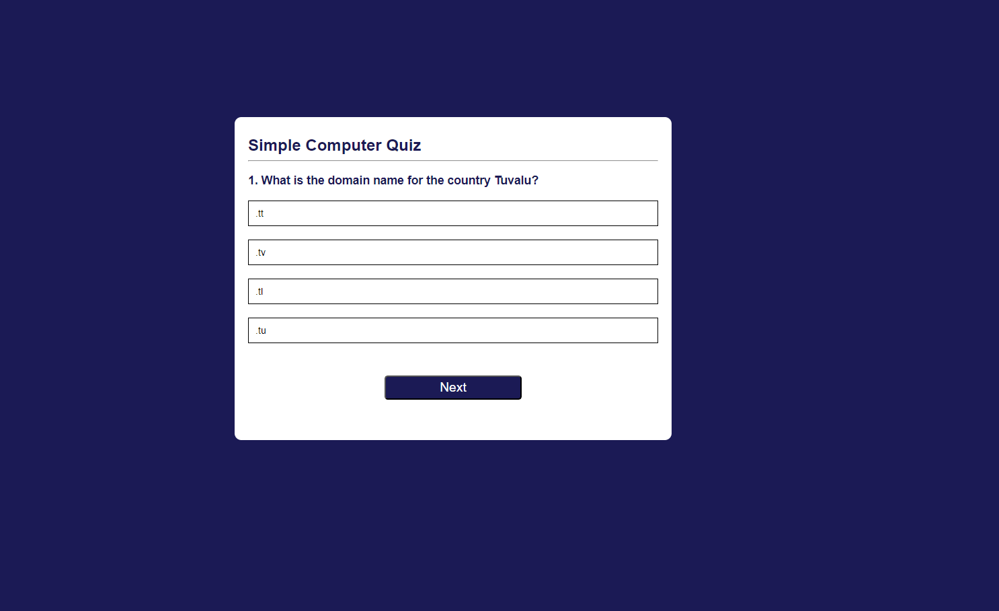

# Quiz App

The Quiz App is a simple web application that allows users to take quizzes on various topics. It fetches questions from an external API and presents them to the user, allowing them to select answers and receive immediate feedback on their performance.

## Features

- Fetch questions from an external API.
- Display one question at a time with multiple-choice answer options.
- Allow users to select an answer and provide immediate feedback on correctness.
- Keep track of the user's score throughout the quiz.
- Allow users to navigate between questions and review their answers.
- Display the final score at the end of the quiz and provide an option to play again.

## Technologies Used

- HTML: Provides the structure and content of the web page.
- CSS: Styles the appearance of the web page and makes it visually appealing.
- JavaScript: Implements the quiz logic, fetches data from the API, handles user interactions, and updates the DOM dynamically.
- Fetch API: Retrieves data from the external API asynchronously.
- GitHub Pages: Hosts the quiz app online for easy access.
